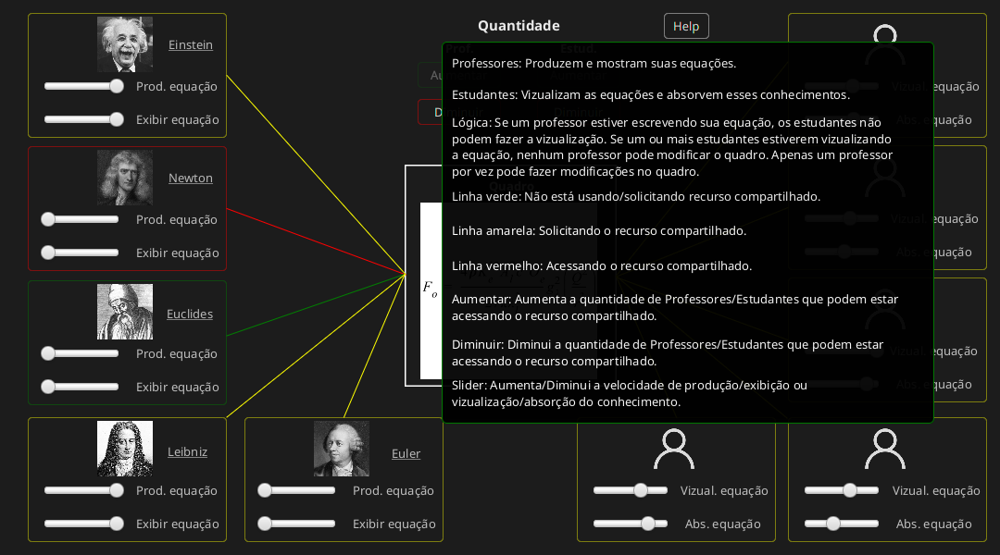

# Trabalho06 - Programacao-Concorrente

Implementação de simulação do Leitor/Escritor através de semáforos.

## Descrição da GUI
  - Leitor: Faz a leitura do quadro com equações ou absorve o conhecimento adquirido.
  - Escritor: Produz equações ou exibe elas no quadro.
  
### Detalhes
  Slider Prod. equação: Tempo para produção da equação (fora RC).
  Slider Exibir equação: Tempo para escrita de uma equação (dentro RC).

  Slider Vizual. equação:  Tempo para vizualização da equação (dentro RC).
  Slider Obs. equação: Tempo para abesorção da equação (fora RC).

  Button Aumentar: Aumenta a quantidade professor (escritor)/estudante (leitor).
  Button Diminui: Diminui a quantidade professor (escritor)/estudante (leitor).

  Button Help: Mostra Pane de ajuda explicando a simulação.

## Screenshots
  
  

  

  

